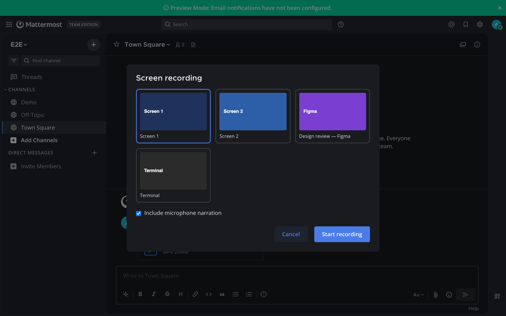
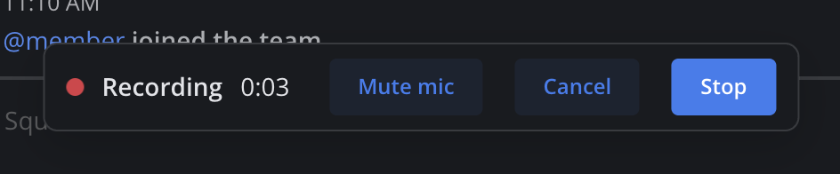
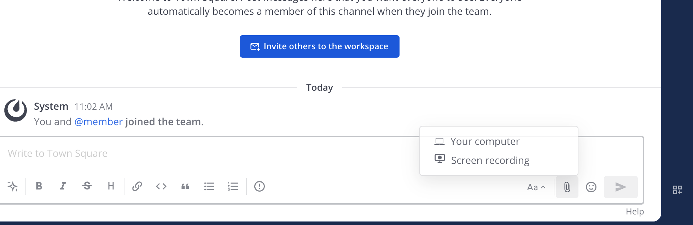
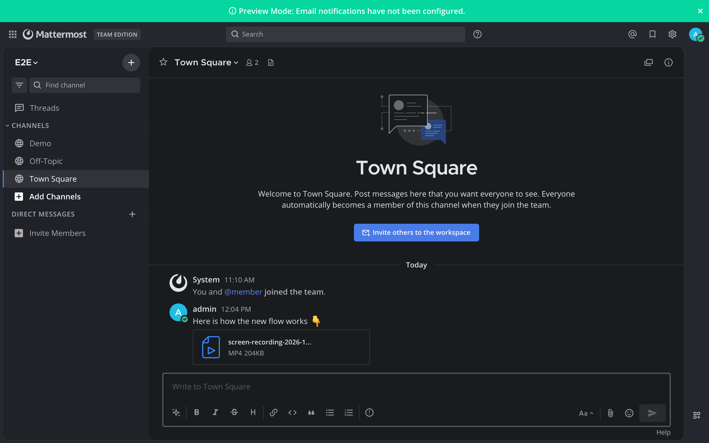

# Screen Recorder for Mattermost

Record your screen — with optional microphone narration — and post it as a video,
straight from the message box. Slack-style clips for Mattermost, in the web app and the
desktop app.



## Features

- **📎 → Screen recording** in any message box — a channel or a thread reply. The video is
  added to that box like any other attachment, so you can type a comment before sending.
- **Pick what to record:** a whole screen or a single app window (desktop app shows
  thumbnails; browsers use their own picker, which also offers a single tab).
- **Microphone narration** on or off, with mute/unmute while recording.
- **MP4 by default** so videos play everywhere, including the iOS and Android apps; WebM
  where a browser can't record MP4 (Firefox), with the video length written in so players
  can show and seek it.
- **Respects your server's upload limit:** recording stops on its own before the file would
  be too large, and tells you why.
- **Web-app only plugin** — no server-side code runs on your Mattermost server.

| Recording bar | In the attachment menu | Posted |
|---|---|---|
|  |  |  |

## Where it works

| Client | Record | Play |
|---|---|---|
| Web app — Chrome, Edge, Firefox, Safari | ✅ browser's own screen/window/tab picker | ✅ |
| Desktop app — macOS, Windows, Linux | ✅ built-in picker with screen and window thumbnails | ✅ |
| Mobile apps — iOS, Android | — (phones don't allow screen capture from apps) | ✅ |

Tested on Mattermost **11.7** (React 18) and **12.0** (React 19) with the same build.
Requires Mattermost **10.11** or later.

## Install

1. Download `dev.patika.screen-recorder-<version>.tar.gz` from the
   [latest release](https://github.com/PatikaDev/mattermost-plugin-screen-recorder/releases/latest)
   (`SHA256SUMS` is attached for verification).
2. **System Console → Plugins → Plugin Management → Upload Plugin**, choose the file, then
   **Enable**. Plugin uploads must be allowed (`PluginSettings.EnableUploads`).

Or with `mmctl`:

```bash
mmctl plugin add dev.patika.screen-recorder-<version>.tar.gz
mmctl plugin enable dev.patika.screen-recorder
```

Users may need to reload the app (Ctrl/Cmd + R) to see the new menu entry.

## Using it

1. Click **📎** in a message box → **Screen recording**.
2. Choose a screen or window (desktop app) and tick **Include microphone narration** if you
   want to talk over it → **Start recording**. In a browser, pick the screen, window or tab
   in the browser's dialog.
3. A bar shows the timer with **Mute mic**, **Cancel** and **Stop**. Ending the share from the
   browser's or the OS's own "Stop sharing" control also stops the recording.
4. **Stop** adds the video to the message box. Add a comment if you like and send.

### Permissions

- **Desktop app:** the first time, Mattermost asks to allow *screen sharing* (when the picker
  opens) and *media* (when recording starts). On **macOS** the system also asks once to
  allow **Screen Recording** for Mattermost in *System Settings → Privacy & Security* — after
  allowing it, quit and reopen Mattermost. The *media* prompt is shown on the main window;
  if nothing seems to happen, look for it there (especially with several monitors).
- **Browsers** show their own screen-sharing dialog every time, and ask once for the
  microphone if narration is on.

### Good to know

- Recordings are capped at **1920×1080**: screen text stays readable and files stay small.
  (Very large or high-DPI screens are captured at enormous sizes that the MP4 encoder
  rejects; the plugin also falls back to WebM automatically if that ever happens.)
- At ~2.5 Mbit/s, a 500 MB upload limit allows about **25 minutes**.
- System sound (audio playing on the computer) is not recorded — only the microphone.
- One screen or window per recording.

## Privacy

The recording is made and kept in your browser or desktop app until you press **Stop**; it is
then uploaded like any other attachment you add to a message, and follows your server's normal
file storage and retention rules. The plugin has no server component and sends nothing anywhere
else.

## Development

Requirements: Node 24.21.0 (see `.node-version`), Go (see `go.mod`, used by the build tooling only), Docker for
the end-to-end tests.

```bash
cd webapp && npm ci
npm run lint && npm run check-types && npm test   # unit tests
cd .. && make dist                                # → dist/dev.patika.screen-recorder-<version>.tar.gz
```

End-to-end tests drive real Chrome against a throwaway Mattermost in Docker:

```bash
cd e2e && npm ci && npx playwright install chrome chromium
MM_VERSION=11.7.11 ./scripts/start-server.sh       # or 12.0.0, …
npx playwright test
npm run server:stop
```

The plugin is built to run unchanged on React 17, 18 and 19 (the server's own React is used at
runtime): keep Babel on the classic JSX runtime and use only APIs available since React 16.8.
See [CONTRIBUTING.md](CONTRIBUTING.md).

Releases are cut by pushing a `v*` tag; CI builds the plugin and attaches it to a GitHub
Release.

## License

[Apache License 2.0](LICENSE). Built on the
[Mattermost plugin starter template](https://github.com/mattermost/mattermost-plugin-starter-template)
— see [NOTICE](NOTICE). Made by [Patika](https://patika.dev).
